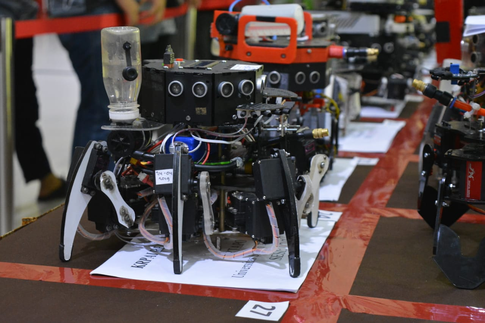
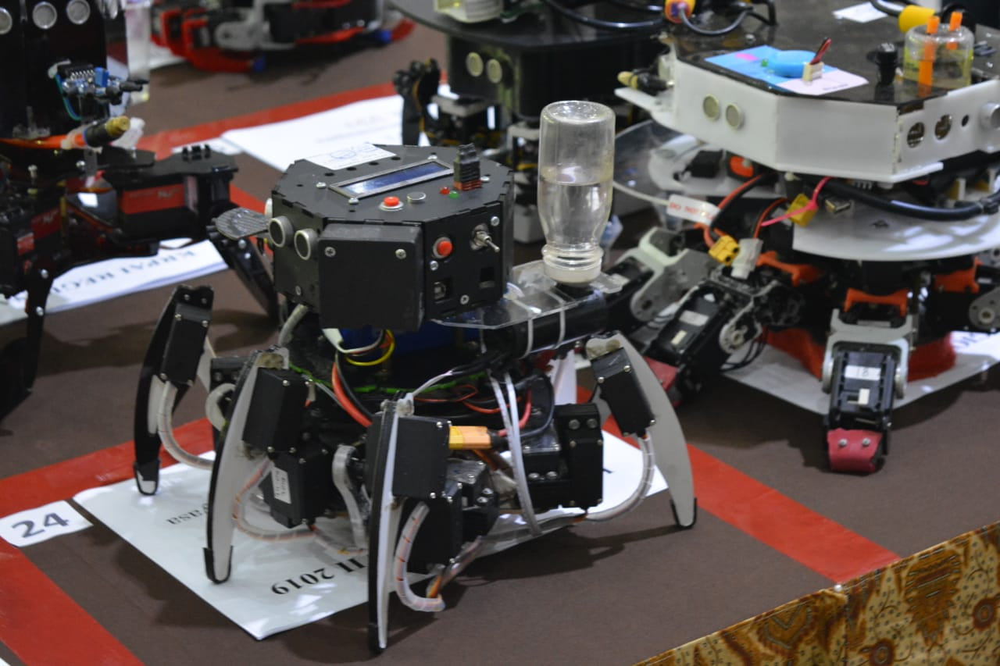

Tirtapods was the name of legged firefigting robot for National Robotic Contest.
It was developed by Untirta Robotic Club and has long development stories. Since
the beginning of this robot creation, it was not competitive enough. Even when
it has so expensive parts in the past. It still can't be compared to other well
known universities' robot. Until National Robotic Contest 2018, it has so many
hacks inside it, yes I call it hack instead of engineering. Many components are
not ideally mounted, the program still lack of responsiveness. While also, those
expensive parts already old. There is no more reason to keep that in.

#### Refactor Everything

Didi Muhadi and Me noticed this disadvantage and decided to refactor **every
single thing**. Didi worked on the circuit design and wiring while I was working
on the programming and calibration. On the other hand, we used existing skeleton
of Tirtapods but with different sensors and extinguisher design.

###### 1. Extinguisher

It now has a new extinguisher design, with shorter pipe and only one cannon
Previously has 3x longer pipe and two cannon. Different water tank and better
DC Motor Pump. With this design, we improved extinguish capability from 4
candles max to 6 candles max with same 50ml water fueled. Even if it has less
area coverage, it was not a problem since the fire detecting sensor was far more
accurate so it can strike the fire at correct position.[[code](https://github.com/Arsfiqball/tirtapods-x/blob/master/tirtapods-war/pump.h)]

###### 2. Fire Detection

We reduced the usage of photodiode to only one line (previously 3) and length of
light isolator to only 1.2cm (previously 2-4cm). But it now has more accurate
flame detection positioning. This is no magic. We just improved the direction to
cover only candle light posible position and avoid another infrared source as
needed and also, the key is in calibration while inside arena. Since it has
less coverage, it is easier to determine the calibration numbers. Overall when
we were testing it only had maximum 2cm inacuracy at 4cm tip of the cannon.[[code](https://github.com/Arsfiqball/tirtapods-x/blob/master/tirtapods-war/flame.h)]

###### 3. Wall Detection

This new robot uses different ping sensor. Instead of using long range expensive
Ping))) sensor, we replaced it with HC-SR04 which is 20x cheaper. This reduce
cost for wall detection sensor from about IDR 2.7m to 130k. But of course we
still improved it **much** by adding essential algorithm: wall recognition. This
program detects wall like a radar and also recognise whether it is a stright
wall, a corner or a dead path. This made easier to do wall following algorithm.
Also we improved the responsiveness by limiting each sensor reading time to 30ms,
using non-blocking program and round robin algorithm so CPU can skip after one
sensor reading for doing another job. It will read another sensor when it comes
back.[[code](https://github.com/Arsfiqball/tirtapods-x/blob/master/tirtapods-war/ping.h)]

###### 4. Obstacle Detection

Below the cannon, we add a light based proximity sensor, which detects object
that can not be detected by ping sensor (e.g obstacle). But because sometimes
there is an error in wall detection and proximity sensor detects object, the
wall is sometimes recognised as an obstacle. So we add a new program to clarify
if it's real obstacle. When proxy detects object, robot will scan to right and
left for 15deg, if wall detection system detects wall, then it can be clarified
that what proxy detected was not obstacle.[[code](https://github.com/Arsfiqball/tirtapods-x/blob/master/tirtapods-war/proxy.h)]

###### 5. Legs Movement System

This is probably the best and the hardest part of Tirtapods-x development. In
the previous, legs movement was a blocking program relayed heavily on delay()
function. While every movement is 4 cycle of delay(200). This made the robot
really not responsive and most of the time, bumping its head before knowing that
it's a wall. So we made a new program that relay on millis() and round robin
algorithm (same as wall detection). With each possible movement has a way to
normalize (stop and stand up).

Calibration method was also much improved. By correctly calculating each legs
inverse kinematics, we made a transpiler which generate C++ code from each legs
expected cartesian position. While we also still require an excel table to
make a note about range and offset of PWM values of each legs.

* [Tirtapod Leg Simulation v1](https://observablehq.com/@arsfiqball/tirtapod-leg-simulation-wip) Observable Notebook
* [Automatic Calibration Calculator](https://github.com/Arsfiqball/tirtapods-x/blob/master/automatic%20calibration%20calculator.xlsx) Excel
* [Transpiler Code](https://github.com/Arsfiqball/tirtapods-x/blob/master/transpiler.html) HTML

###### 6. Sound Activation

We used existing circuit design to rebuild sound activation and added new
case which was more compact and still easy to calibrate. Because of the non
blocking program we implement in every aspect, sound activation also can
respond imediately.

###### 7. Panel Control

We droped all four existing calibration button because it was forbidden
that time and then end up using combination of start and stop button to
choose calibration status menu. We also added program to show what robot
was currently doing. Because to indicate if all transducers worked as
expected by the microcontroller.

###### 8. Algorithm Overall

We made sequence of 3 major algorithm and encapsulate them on their own
function blocks. Those 3 are Avoid Wall, Flame Detection, Trace Route. So,
if Avoid Wall is not complete, then don't do Flame Detection and so on.
Avoid Wall has job as it's named. Flame Detection has job to detect flame,
get a way to it, stop at safe distance from candle flame and extinguish it.
Trace Route has job to get safe distance to wall for wall following and do
the wall following algorithm.

###### 9. Programming Optimization

The biggest improvement was the implementation of non-blocking concept. We
avoid using delay as much as possible, except for ping sensor which takes
only 30ms (it's ok). We used millis heavily and combined it with state
variable to make last recorded time counter on each delay replacement. When
margin of time matched the delay needed, then callback is used to continue
particular work.

Another great improvement was dynamic memory usage reduction from 95% to 4%
by replacing literal string with constants (using macro F by Arduino). This
string is heavily used for serial communication to Servo Driver Controller
and LCD.

Credits to:

1. Didi Muhadi Jalali (partner KRPAI 2019)
2. Yoga Faisal Mahfudz (partner KRPAI 2019)
3. Emir Sadzali and all URC staff
4. Dr. Romi Wiryadinata (advisor)
5. Tirtapods Former Engineer
