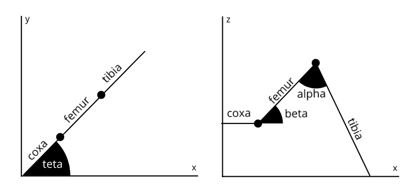
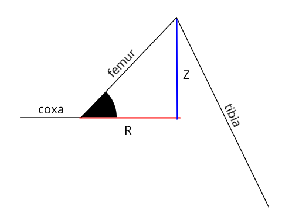
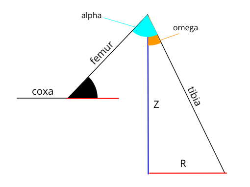

Last night I just done making simulation of single leg of Tirtapod (a hexapod robot) on Observable Notebook to simulate both forward and inverse kinematics of it. You can see it in action [right here](https://beta.observablehq.com/@arsfiqball/tirtapod-leg-simulation-wip). The funny part was, I actually calculated the inverse kinematics first rather than the forward. Then I begin to realize that I need forward function to simulate it.
<!-- more -->
To begin with, I want to explain the definition of forward and inverse kinematics in this research. So, when I do forward kinematics, that means I put every angular movement as input then the result is cartesian movement (x, y, z). When I do inverse kinematics, that means the reverse, cartesian as input and the result is angular.



Each single leg of Tirtapod is consisting of 3 servos (teta, beta, alpha) and 3 bones (coxa, femur, tibia). Length of bones is always be static coxa 2 cm, femur 5 cm and tibia 9 cm. While the teta angle is rotation movement of coxa (z is static), beta is the angle created between femur and z = 0, alpha is the angle created between tibia and femur.

# Forward Kinematics

The finish line of this forward kinematics is to find correct cartesian coordinates of the tip of tibia (x<sub>2</sub>, y<sub>2</sub>, z<sub>2</sub> of tibia). We can find it out by calculating each point's coordinate of coxa, femur and tibia one by one. So this is the function we need to create.

```js
cartesian = (teta, beta, alpha) => ({ x, y, z })
coxa = (teta, length) => ({ x1, y1, z1, x2, y2, z2 })
femur = (coxa, teta, beta, length) = ({ x1, y1, z1, x2, y2, z2  })
tibia = (femur, teta, beta, alpha, length) = ({ x1, y1, z1, x2, y2, z2 })
```

### Calculate COXA

Calculating Coxa is easy done using simple trigonomtry. Because we know:

```js
x = l * cos(teta)
y = l * sin(teta)
z = 0
```
where l is the length of Coxa itself (2 cm) and Z is always zero because Coxa can't move up or down. So function would be like this.

```js
coxa = (teta, length) => ({
  x1: 0,
  y1: 0,
  z1: 0,
  x2: length * cos(teta),
  y2: length * sin(teta),
  z2: 0
})
```

### Calculate FEMUR

Before calculate X or Y axis of femur, we need to find R which is the distance of tip to tip ignoring Z-axis. Then we can do simple trigonometry againts R (instead of actual length) like in Coxa. While Z is easy to find.

```js
Z = l * sin(beta)
R = l * cos(beta)
x = R * cos(teta)
y = R * sin(teta)
```



To calculate femur, require coxa's tip position. So it can be defined where real position of femur. Remember that femur x<sub>1</sub>, y<sub>1</sub>, and z<sub>1</sub> will always be the same with coxa x<sub>2</sub>, y<sub>2</sub>, and z<sub>2</sub>. Here is the result function.

```js
femur = (coxa, teta, beta, length) => ({
  x1: coxa.x2,
  y1: coxa.y2,
  z1: coxa.z2,
  x2: coxa.x2 + length * cos(beta) * cos(teta),
  y2: coxa.y2 + length * cos(beta) * sin(teta),
  z2: coxa.z2 + length * sin(beta)
})
```

### Calculate TIBIA

Tibia is a little bit complicated. To find it, we'll need a helper angle. We'll call it omega. First thing first, remember that every triangular form has total angle of 180. Now look at the image below.



See that femur length, femur R and femur Z can make their own "right" triangle. If corner is 90 deg, another is beta, then the remaining is **180 deg - 90 deg - beta** or we can simplify **90 deg - beta**. To find the "omega" above we can simply substract alpha by angle of this remaining corner. Then we can perform simple trigonometry calculation again. But because the direction of Z is negative, remember to put negation there.

```js
omega = alpha - (PI/2 - beta)
Z = - l * cos(omega)
R = l * sin(omega)
```

Wrap them up, and here is the result function.

```js
tibia = (femur, teta, beta, alpha, length) => ({
  x1: femur.x2,
  y1: femur.y2,
  z1: femur.z2,
  x2: femur.x2 + length * sin(alpha - (PI/2 - beta)) * cos(teta),
  y2: femur.y2 + length * sin(alpha - (PI/2 - beta)) * sin(teta),
  z2: femur.z2 - length * cos(alpha - (PI/2 - beta))
})
```

### Make it One Function

We'll call it "cartesian" function same as what we discuss earlier in this forward kinematics section. The input must be angular, and output is cartesian. Here it is.

```js
cartesian = (teta, beta, alpha) => {
  c = coxa(teta, 2)
  f = femur(c, teta, beta, 5)
  t = tibia(f, teta, beta, alpha, 9)
  return {
    x: t.x2,
    y: t.y2,
    z: t.z2
  }
}
```

---

Okay it's done for Forward Kinematics. Check [this Observable Notebook](https://beta.observablehq.com/@arsfiqball/tirtapod-leg-simulation-wip) to see the simulation. For the next part, I will explain the inverse function.
