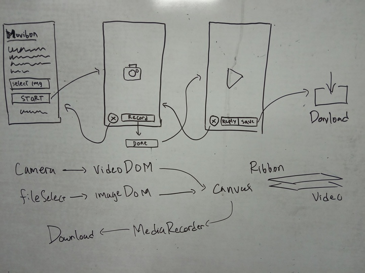

Today I get some inspiration to make something useful. Last night, I work
on a take home task for middle test of Image Processing class. I got a lot
of things to do with Open CV for image processing in python. I thought that
the task would bore me but then made me get excited instead. Then I
remember that a few days later there will be an event. Usually the event
organizer will make something called Twibbon. It's a template ribbon
(usually an image frame) to be overlayed on top of someone's profile picture.
But the trend is now decreasing and people are not interested like in the
past. I see that people are more excitied in instagram story and its filter
and decoration. So why wouldn't we made a twibbon which works not only
for image but also video. Maybe it will gather more attention.

The Idea is to make a video recorder which has image frame already
overlayed on top of it. People can easily take video while previewing if
it's fit to the ribbon template. When it's done, they can simply download
it as a video file. They can share it in any platform they want.

### Sketch & Plan

I want it to be simple and has minimum posible effort to use. This app
must work on browser. That's why I called it online service rather than
app. Because it needs browser to work. But people don't need to download
it. Here is the sketch and plan.

So at least we have 8 interaction events in UI:

1. File input changes: this will set template ribbon image.
2. Click start: create screen for video recording with size cover the template.
3. Click close recorder: close the screen.
4. Click record: start recording video.
5. Click done: stop recording video, generate video buffer and open video player.
6. Click clean: close video player.
7. Click replay: play video.
8. Click save: download the buffer video.

So the template must be loaded first. This is because, we need its width and
height to create the screen. When it's done, camera view will be made with size
covering the screen. Then we can overlay and render them each 16ms tick in
canvas which is the screen itself. When record button is pressed, MediaRecorder
will encode canvas into mp4 and stream its chunk. When user pressed done, we
merge the chunk into single blob and open video player.

### Programming

When I say "only JavaScript", that really means __Vanilla JavaScript__. No
framework, no transpilation and nothing other than javascript work on browser.
Because I want to start it simple with native browser support. When this program
becomes more complex, I will begin rewrite it to be based on framework.

OK since I'm not really that good in coding explanation, let me just give you a
link to the [commit](https://github.com/Arsfiqball/muvibon.arsfiqball.com/commit/b00f73d31756f12f0d90bad855c9021d971fd465)
and [repository](https://github.com/Arsfiqball/muvibon.arsfiqball.com)

### References

* Mozilla Developer Network: [Audio and video manipulation](https://developer.mozilla.org/en-US/docs/Web/Guide/Audio_and_video_manipulation)
* Mozilla Developer Network: [Taking still photos with WebRTC](https://developer.mozilla.org/en-US/docs/Web/API/WebRTC_API/Taking_still_photos)
* StackOverflow: [How to save canvas animation as gif or webm?](https://stackoverflow.com/questions/50681683/how-to-save-canvas-animation-as-gif-or-webm)
* StackOverflow: [How to add image to canvas](https://stackoverflow.com/questions/6011378/how-to-add-image-to-canvas)
* StackOverflow: [How can I detect width and height of the webcamera?](https://stackoverflow.com/questions/47593336/how-can-i-detect-width-and-height-of-the-webcamera)
