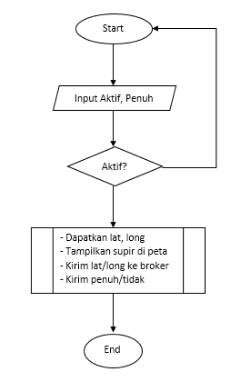
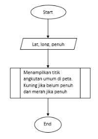
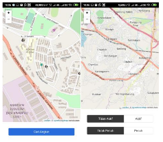
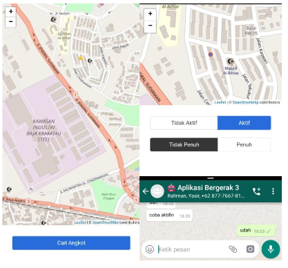

##### i. Kontributor

| NIM             | Nama                     |
| --------------- | ------------------------ |
| 3332160053      | Iqbal Mohammad Abdul G.  |
| 3332160071      | M. Rahman Septian        |
| 3332160048      | Yasi Riyanto             |
| 3332160082      | Muhammad Iqbal           |

##### ii. Hasil Kerja

* Aplikasi [Mamangkot-supir.apk](https://drive.google.com/file/d/1uXOXxopa7BZ65ZLSVUvQBD4PKQVtnvEh/view)
* Aplikasi [Mamangkot-penumpang.apk](https://drive.google.com/file/d/1chnQn3Eo9OUFA4FvprTc9Mdgt2jIkXgp/view)
* Kode sumber lengkap [Mamangkot di GitHub](https://github.com/Arsfiqball/mamangkot)
* Softcopy [Laporan](/)

---

##### 1. Pendahuluan

##### 1.1 Latar Belakang

Angkutan kota kian lama ditinggalkan seiring hadirnya transportasi berbasis
aplikasi seperti ojek dan taksi online. Aksesibilitas menjadi salah satu alasan.
Penumpang juga masih harus ragu untuk naik ketika angkot datang karena
kemungkinan penuh.Berbeda dengan dulu dimana angkutan kota adalah transportasi
utama karena hadirnya lebih cepat dan dapat diprediksi. Saat ini transportasi
berbasis aplikasi lebih dipilih karena lebih unggul pada dua hal tersebut. Meski
mungkin ada alasan lain seperti kenyamanan dan layanan aduan. Padahal jika saja
calon penumpang bisa mengetahui apakah akan ada angkot yang lewat dalam waktu
dekat sehingga mereka tidak harus menunggulama. Kemungkinanbesarmereka akan
lebih memilih angkot. Karena tarif yang lebih terjangkau.

##### 1.2 Rumusan Masalah

1. Bagaimana cara memberi tahu lokasi angkot terdekat sehingga mereka bisa
   memutuskan untuk menunggu atauberalih transportasi.
2. Bagaimana memberi tahu calon penumpang bahwa angkot yang datang sudah penuh
   atau belum.

##### 1.3 Tujuan

1. Membuat aplikasi yang menghubungkan supir angkot ke calon penumpang untuk
   memberi tahu dimana lokasi angkot-angkot yang aktif saat itu.
2. Membuat aplikasi yang bisa memberi tahu angkot mana saja yang sudah penuh
   dengan penumpang atau tidak.

---

##### 2. Tinjauan Pustaka

##### 2.1 Aplikasi Bergerak

Aplikasi Bergerak (Mobile App) adalah sebuah aplikasi yang memungkinkan Anda
melakukan mobilitas dengan menggunakan perlengkapan seperti PDA, telepon seluler
atau Handphone.[1] Dengan menggunakan aplikasi mobile, Anda dapat dengan mudah
melakukan berbagai macam aktifitas mulai dari hiburan, berjualan, belajar,
mengerjakan pekerjaan kantor, browsing dan lain sebagainya. Pemanfaatan aplikasi
mobile untuk hiburan paling banyak digemari oleh hampir 70% pengguna telepon
seluler, karena dengan memanfaatkan adanya fitur game, music player, sampai
video playermembuat kita menjadi semakin mudah menikmati hiburan kapan saja dan
dimanapun. Saat ini platform aplikasi mobile didominasi oleh sistem operasi
bawaannya. Yaitu Android dan IOS.

##### 2.2 Platform Aplikasi Android

Android adalah sistem operasi yang dirancang oleh Google dengan basis kernel
Linux untuk mendukung kinerja perangkat elektronik layar sentuh, seperti tablet
atau smartphone. Android bersifat open sourceatau bebas digunakan, dimodifikasi,
diperbaiki dan didistribusikan oleh para pembuat ataupun pengembang perangkat
lunak. Begitupun dengan para pembuat aplikasi, mereka bebas membuat aplikasi
dengan kode-kode sumber yang dikeluarkan google. Android memiliki jutaan support
aplikasi gratis/berbayar yang dapat diunduh melalui google play.

##### 2.3 Global Positioning System (GPS)

Global Positioning System(GPS) adalah sistem navigasi berbasis satelit yang
terdiri dari setidaknya 24 satelit. Departemen Pertahanan AS (USDOD) awalnya
menempatkan satelit ke orbit untuk penggunaan militer, tetapi mereka dibuat
tersedia untuk digunakan sipil pada 1980-an.

Satelit GPS mengelilingi Bumi dua kali sehari dalam orbit yang tepat. Setiap
satelit mengirimkan sinyal unik dan parameter orbital yang memungkinkan
perangkat GPS untuk memecahkan kode dan menghitung lokasi tepat dari satelit.
Penerima GPS menggunakan informasi dan trilaterasi ini untuk menghitung lokasi
pasti pengguna. Pada dasarnya, penerima GPS mengukur jarak ke masing-masing
satelit dengan jumlah waktu yang diperlukan untuk menerima sinyal yang
dikirimkan. Dengan pengukuran jarak dari beberapa satelit lagi, penerima dapat
menentukan posisi pengguna dan menampilkannya secara elektronik.

##### 2.4 Sistem Informasi Geografis

Sistem Informasi Geografis (SIG) atau Geographic Information System (GIS)
sendiri merupakan sistem berbasis komputer yangdigunakan untuk menyimpan,
memanipulasi, dan menganalisa informasi geografis.[2]Sebelum adanya Sistem
Informasi Geografis (SIG) ini, sejumlah informasi permukaan bumi disajikan dalam
peta yang dibuat secara manual. Hadirnya SIG dapat mengolah komponen peta
tersebut dalam komputer, kemudian hasilnya berupa peta digital.

##### 2.5 Arsitektur Messaging Publish/Subscribe

Pada pola publish-subscribe, pertukaran data tidak dilakukan secara langsung
seperti halnya REST API melainkan difasilitasi oleh sebuah perantara yang
dikenal dengan sebutan message broker. Data yang dipertukarkan disebut Message,
yang dibagi-bagi ke dalam beberapa topic/class. Masing-masing microservice dapat
mendengarkansuatu topic(subscribe) atau mengirimkan data kepada topic tertentu
(publish).[3]

---

##### 3. Pembahasan

##### 3.1 Perancangan

Aplikasi mamangkot terdiri dari tiga program yaitu: Mamangkot Supir, Mamangkot
Penumpang dan Mamangkot Service Broker. Ketiganya memiliki peran dan kegunaan
masing-masing. Mamangkot Supir dipakai oleh supir angkutan umum untuk mengirim
posisi dan kondisi apakah mobilnya penuh/belum secara real-time. Mamangkot
Penumpang dipakai oleh penumpang angkutan umum untuk menerima dimana saja letak
angkutan umum yang sedang aktifdan statusnya apakah penuh/tidak. Sementara
Mamangkot Service Brokerdi sini sebagai perantara yang berfungsi menerima pesan
dari supir dan menyebarkanya ke penumpang.

##### 3.1.1 Mamangkot Supir

Aplikasi mamangkot supir dirancang dengan memiliki dua input dan satu output
berbentuk peta untuk supir memverifikasi posisi dia. Input tersebut yaitu:

1. Kondisi Aktif / Tidak aktif, dimana ini digunakan oleh supir untuk
   memperlihatkan bahwa supir angkot sedang aktif. Tidak dalam kondisi
   istirahat. Jika dipilih aktif, maka aplikasi akan mengirimkan posisi supir ke
   service broker.
2. Kondisi Penuh / Tidak penuh, dimana ini digunakan oleh supir untuk
   memperlihatkan bahwa mobil angkutan umum tersebut sudah penuhatau belum oleh
   supir. Jika dipilih penuh, maka posisi yang dikirimkan nantinya juga
   disisipkan informasi full= true.

Alur kerja mamangkot supir ditunjukan pada Gambar 2 dimana aplikasi menerima dua
input. Kemudian ditentukan apakah aplikasi harus mengirim data ke service broker
atau tidak. Jika supir aktif, maka input penuh/tidak diteruskan ke proses
selanjutnya yaitu mendapatkan latitude dan longitude dari GPS, menampilkan
posisi supir tersebut di peta kemudian mengirimkan data latitude, longitude dan
penuh/tidak ke service broker.

##### 3.1.2 Mamangkot Penumpang

Mamangkot penumpang menerima data dari service broker yang sebenarnya dikirimkan
oleh supir. Sehingga input sebenarnya adalah dari service broker. Namun pada
aplikasi ini juga akan disisipkan tombol “Cari Angkot” untuk merefresh titik
angkutan umum di peta. Berikut ini alur kerjanya.

##### 3.1.3 Mamangkot Service Broker

Seperti dijelaskan sebelumnya, mamangkot service brokerberperan menerima data
dari supir kemudian menyebarkannya ke calon penumpang. Sehingga input dari
program ini adalah latitude, longitude dan penuh/tidak. Sementara outputnya sama
persis dengan yang diinputkan.

##### 3.2 Implementasi

Mamangkot supir dan mamangkot penumpang dibuat menggunakan platform android
sementara service broker menggunakan Node.js sebagai service broker. Bahasa
pemrograman yang digunakan semuanya menggunakan JavaScript dan tambahan HTML/CSS
untuk antar muka pengguna. Secara lengkap, peralatan yang digunakan antara lain:

1. Android Studio - untuk membuat APK
2. Node.js - menjalankan program Javascript
3. Library Node.js (Capacitor, Socket.io, Leaflet)
4. PM2 - untuk menyalakan Node.js service broker

Hasil pembuatan aplikasi ditunjukan pada Gambar 4 berikut ini. Sementara service
broker tidak memiliki tampilan dan berjalan di server dengan perintah:
`pm2 start index.js`

##### 3.3 Pengujian

Pengujian dilakukan dengan satu orang di Ramanujusebagai penumpangdan orang
lainnya di komplek D-flat Krakatau Steel sebagai supir. Seperti ditunjukan pada
Gambar 6, terlihat titik kuning pada tampilan angkot menunjukan lokasi supir
angkot dengan kondisi angkot yang tidak penuh sesuai dengan tampilan supir.

Namun terdapat kendala yaitu ketika aplikasi ditutup atau pindah tab, maka
informasi pelacakan hilang atau tidak dikirim. Setelah ditelusuri, ternyata
memang platform android akan membekukan aplikasi ketika tidak dipakai. Ini yang
menyebabkan aplikasi supir tidak bisa membuka aplikasi lainnya saat aktif.

---

##### 4. Penutup

##### 4.1 Kesimpulan

Setelah melakukan penelitian pembuatan aplikasi Mamangkot ini, diperolehlah
kesimpulan bahwa aplikasi ini bisa digunakan untuk angkutan umum dan calon
penumpangnya meski ada sedikit kelemahan karena aplikasi masih belum bisa
digunakan saat tertutup atau multi tasking.

#### 4.2 Saran

Untuk pengembangan berikutnya disarankan menerapkan teknologi service worker
sehingga aplikasi bisa berjalan di background dan pelacakan masih bisa dilakukan
meski aplikasi tertutup.

---

##### Daftar Pustaka

1. Farida Yonarisa, STMIKAKAKOM Yogyakarta, “Mobile Apps”, 2012. [Online]. Tersedia: http://blog.akakom.ac.id/faridayonarisa/2012/09/07/mobile-apps/ [diakses pada Kamis, 26 Desember 2019]
2. IlmuGeografi.com, “Sistem Informasi Geografis : Jenis – Manfaat – Tujuan – Sumber Data”. [Online]. Tersedia: https://ilmugeografi.com/geografi-teknik/sistem-informasi-geografis [diakses pada Jumat, 27 Desember 2019]
3. Muhammad Aditya Hilmy, HMIF ITB, “Event-driven Architecture dengan Messaging Pub/Sub”. [Online]. Tersedia: https://medium.com/hmif-itb/event-driven-architecture-dengan-messaging-pub-sub-56144e0c6d61 [diakses pada Jumat, 27Desember 2019]
