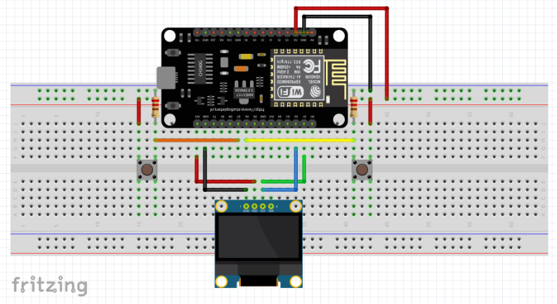

Before we go any further, I just want to explain that this more like just a
controllable animation. Not really a real game. Because there is no scoring or
level. But the objective of this article is about how to use 0.96" 128x64 OLED
Display to show image, text, animation etc.

All resources you need is here: https://github.com/Arsfiqball/luv-u-fir-oled-0.96
Keep reading if you want more explanation 🔥

---

## Circuit Board

We will make a simple game with two control button. One on the left and one on
the right. This control button will move the player figure in the game. We also
need to add 10k resistor to each push button. These resistor will be a pull up
to make sure those push button pins always get near 5v. You can do pull up
voltage programmatically using pin mode `INPUT_PULLUP` instead of `INPUT`. But
for me this is safer.

Microcontroller used for this project is not necessarily needs to be NodeMCU v3.
It can be any MCU with I2C SDA & SCL support. You can just start with Arduino if
you already have one. Different board has different SDA and SCL pin address. So
make sure you read that MCU datasheet first and place the SDA & SCL pin
correctly.

So components you need are:
* NodeMCU v3
* 0.96" 128x64 OLED Display
* Resistor 10K x 2
* Push Button x 2



---

## Programming

I use PlatformIO to build and upload the code. It is an extension built on top
of VS Code. I never done it, but I think you can use Arduino IDE too. You must
add Adafruit SSD1306 and Adafruit GFX library. Don't forget configure the
project with NodeMCUv3 as the upload target.

---

#### Declaration

Include all headers needed. I actually copy this from Adafruit's official
example with a little bit addition (`Adafruit_I2CDevice.h` & `cstdlib`). I wasn't
sure whether `SPI.h` was needed or not. Because we use only I2C communication. It
just comes with the example, I was too lazy to figure out. Header `cstdlib` is
needed to enable us using `rand()` function.

```c++
#include <SPI.h>
#include <Wire.h>
#include <Adafruit_I2CDevice.h>
#include <Adafruit_GFX.h>
#include <Adafruit_SSD1306.h>
#include <cstdlib>
```

Declare all static parameters needed. So we don't need to retype every digit
everywhere. Everything will be configurable here. Hexadecimal: `0x3C` is the I2C
address of 0.96" 128x64 OLED Display. Different module may have different I2C
address. Also we will use NodeMCU's reset button to reset OLED Display (so set
it to -1).

```c++
#define SCREEN_WIDTH 128     // OLED display width, in pixels
#define SCREEN_HEIGHT 64     // OLED display height, in pixels
#define REFRESH_MS 20        // Game screen refresh interval (ms)
#define PLAYER_WIDTH 12      // Girl image width (checkout player_bmp)
#define PLAYER_HEIGHT 16     // Girl image height (checkout player_bmp)
#define PLAYER_SPEED 4       // Girl movement speed in pixel per refresh interval
#define CPU_WIDTH 12         // Boy image width (checkout cpu_bmp)
#define CPU_HEIGHT 18        // Boy image height (checkout cpu_bmp)
#define CPU_SPEED 1          // Boy movement speed in pixel per refresh interval
#define NUM_TEXT 24          // Number of random text available in setText(i)
#define PIN_PUSH_RIGHT D6    // Digital pin for right side push button
#define PIN_PUSH_LEFT D7     // Digital pin for left side push button
#define I2C_ADDR_OLED 0x3C   // I2C address (SDA & SCL) for OLED 128x64 Display
#define OLED_RESET -1        // OLED Reset Pin
```

Initialize `display` object:

```c++
Adafruit_SSD1306 display(SCREEN_WIDTH, SCREEN_HEIGHT, &Wire, OLED_RESET);
```

Create player image bitmap. This bitmap is actually an image of a girl with
hijab and eye glasses. You can make bitmap image by converting your existing
image to monochrome and pixelated. But usually it has char[] data type. I have
already done it but the image generated was not as good as expected. So I
decided to draw it manually in binary. Yes binary...

```c++
static const bool player_bmp[] = {
  0, 0, 1, 1, 1, 1, 1, 1, 1, 0, 0, 0,
  0, 1, 0, 0, 1, 0, 0, 0, 0, 1, 0, 0,
  0, 1, 0, 0, 0, 1, 1, 0, 0, 0, 1, 0,
  0, 1, 0, 0, 0, 0, 0, 1, 0, 0, 1, 0,
  0, 0, 0, 0, 0, 0, 0, 0, 0, 0, 0, 1,
  1, 1, 1, 1, 0, 1, 1, 1, 1, 0, 0, 1,
  1, 0, 0, 1, 1, 1, 0, 0, 1, 0, 0, 1,
  1, 1, 1, 1, 0, 1, 1, 1, 1, 0, 0, 1,
  0, 0, 0, 0, 0, 0, 0, 0, 0, 0, 0, 1,
  0, 0, 0, 1, 1, 0, 0, 0, 0, 0, 0, 1,
  0, 0, 0, 0, 0, 0, 0, 0, 0, 0, 1, 0,
  0, 0, 0, 0, 0, 0, 0, 0, 0, 0, 1, 0,
  0, 1, 0, 1, 0, 0, 0, 0, 0, 0, 1, 0,
  0, 1, 0, 1, 1, 1, 1, 1, 1, 1, 1, 0,
  0, 0, 0, 1, 1, 1, 1, 1, 1, 1, 1, 0,
  0, 0, 0, 1, 1, 1, 1, 1, 1, 1, 1, 1,
};
```

Create bot cpu image bitmap. This is bitmap image of a boy with ❤️ in his eyes.

```c++
static const bool cpu_bmp[] = {
  1, 1, 1, 1, 1, 1, 1, 1, 0, 0, 0, 0,
  0, 1, 1, 1, 1, 1, 1, 1, 1, 0, 0, 0,
  0, 1, 1, 1, 1, 1, 1, 1, 1, 1, 0, 0,
  1, 1, 0, 1, 1, 1, 1, 1, 1, 1, 1, 0,
  1, 0, 0, 0, 1, 0, 0, 1, 1, 1, 1, 1,
  0, 0, 0, 0, 0, 0, 0, 0, 1, 0, 1, 1,
  1, 0, 1, 0, 1, 0, 1, 0, 0, 0, 1, 1,
  1, 1, 1, 0, 1, 1, 1, 0, 0, 0, 1, 1,
  0, 1, 0, 0, 0, 1, 0, 0, 0, 1, 1, 0,
  0, 0, 0, 0, 0, 0, 0, 0, 1, 1, 0, 0,
  0, 0, 0, 1, 0, 1, 0, 0, 1, 0, 0, 0,
  0, 0, 0, 0, 1, 0, 0, 0, 0, 0, 0, 0,
  0, 0, 0, 0, 0, 0, 0, 0, 1, 0, 0, 0,
  0, 1, 1, 1, 0, 0, 0, 1, 0, 1, 0, 0,
  0, 0, 0, 1, 0, 0, 0, 1, 0, 0, 0, 0,
  0, 0, 0, 1, 1, 1, 1, 1, 0, 0, 0, 0,
  0, 0, 0, 1, 1, 1, 1, 1, 0, 0, 0, 0,
  0, 0, 0, 1, 1, 0, 1, 1, 0, 0, 0, 0,
};
```

Initalize game global states.

```c++
uint16_t state_playerPosX = 10; // initially on the left
uint16_t state_cpuPosX = SCREEN_WIDTH - CPU_WIDTH - 10; // initially on the right
bool state_playerFlipped = true; // facing right 
bool state_cpuFlipped = false; // facing left
bool state_changeText = false; // initially no text changing state
unsigned int state_randomIndex = 1000; // initally using random number outside NUM_TEXT
```

Abstractly declare function to define it later.

```c++
void drawPlayer (uint16_t playerX, bool flipped);
void drawCPU (uint16_t posX, bool flipped);
void setText (unsigned int i);
```

---

#### Setup

Setup both push button pins and also check I2C connection to OLED. Built-in
Serial connection here is only used for debugging purpose.

```c++
void setup() {
  Serial.begin(9600);

  pinMode(PIN_PUSH_RIGHT, INPUT);
  pinMode(PIN_PUSH_LEFT, INPUT);

  if(!display.begin(SSD1306_SWITCHCAPVCC, I2C_ADDR_OLED)) {
    Serial.println(F("SSD1306 allocation failed"));
    for(;;);
  }

  display.display();
  delay(2000);
}
```

---

#### Loop 

This game loop is where most of things happen. Get both inputs from buttons.
Reset text cursor. Show scene. Process game logics. Draw all figures and display
it. I add delay in this loop so the game can run predictably at 50FPS (20ms
refresh time).

```c++
void loop() {
  bool pushRight = digitalRead(PIN_PUSH_RIGHT);
  bool pushLeft = digitalRead(PIN_PUSH_LEFT);

  display.clearDisplay();
  display.drawLine(0, SCREEN_HEIGHT - 1, SCREEN_WIDTH - 1, SCREEN_HEIGHT - 1, SSD1306_WHITE);
  display.setCursor(0, 0);
  display.setTextColor(SSD1306_WHITE);
  display.setTextWrap(true);

  // ... Game logics

  setText(state_randomIndex);
  drawPlayer(state_playerPosX, state_playerFlipped);
  drawCPU(state_cpuPosX, state_cpuFlipped);

  display.display();
  delay(REFRESH_MS);
}
```

Player control logics. These game logics actually just change the global state
based on input and previous state. Those global state will be used by the drawer.

```c++
  if (pushRight && state_playerPosX < (SCREEN_WIDTH - PLAYER_WIDTH)) {
    state_playerPosX += state_playerPosX < ((SCREEN_WIDTH - PLAYER_WIDTH) - PLAYER_SPEED) ? PLAYER_SPEED : 0;
    state_playerFlipped = true;
  } else if (pushLeft && state_playerPosX > 0) {
    state_playerPosX -= state_playerPosX > PLAYER_SPEED ? PLAYER_SPEED : 0;
    state_playerFlipped = false;
  } else {
    if (state_playerPosX > state_cpuPosX) {
      state_playerFlipped = false;
    } else {
      state_playerFlipped = true;
    }
  }
```

CPU control logics. When the CPU bot stops following the player, it will change
`state_randomIndex` with random number. Which essentially change the quoted text.

```c++
  if (state_playerPosX > (state_cpuPosX + PLAYER_WIDTH + 4)) {
    state_cpuPosX += CPU_SPEED;
    state_cpuFlipped = true;
    state_changeText = true;
  } else if (state_playerPosX < state_cpuPosX - PLAYER_WIDTH - 4) {
    state_changeText = true;
    state_cpuPosX -= CPU_SPEED;
    state_cpuFlipped = false;
  } else {
    if (state_playerPosX > state_cpuPosX) {
      state_cpuFlipped = true;
    } else {
      state_cpuFlipped = false;
    }

    if (state_changeText) {
      state_changeText = false;
      state_randomIndex = rand() % NUM_TEXT;
    }
  }
```

#### Functions

Draw player in X coordinate. The player originally faced left, flip it to face
to right.

```c++
void drawPlayer (uint16_t playerX, bool flipped) {
  uint16_t playerY = 46;

  for (uint16_t y = 0; y < PLAYER_HEIGHT; y++) {
    for (uint16_t x = 0; x < PLAYER_WIDTH; x++) {
      if (player_bmp[y * PLAYER_WIDTH + x] == 1) {
        display.drawPixel(playerX + (flipped ? PLAYER_WIDTH - x : x), playerY + y, SSD1306_WHITE);
      }
    }
  }
}
```

Draw CPU in X coordinate. The CPU originally faced left, flip it to face to right.

```c++
void drawCPU (uint16_t posX, bool flipped) {
  uint16_t posY = 44;

  for (uint16_t y = 0; y < CPU_HEIGHT; y++) {
    for (uint16_t x = 0; x < CPU_WIDTH; x++) {
      if (cpu_bmp[y * PLAYER_WIDTH + x] == 1) {
        display.drawPixel(posX + (flipped ? PLAYER_WIDTH - x : x), posY + y, SSD1306_WHITE);
      }
    }
  }
}
```

Set text to show based on the index.

```c++
void setText (unsigned int i) {
  switch (i) {
    case 0:
      display.println(F("Hmm... Fir, nyari kemanapun juga ga ada yang semanis kamu."));
      break;
    case 1:
      display.println(F("Miss u fir..."));
      break;
    case 2:
      display.println(F("Fir, ga capek apah di dunia nyata ketemu, di mimpi ketemu juga..."));
      break;
    case 3:
      display.println(F("Hai"));
      break;
    case 4:
      display.println(F("Fir..."));
      break;
    case 5:
      display.println(F("Love u"));
      break;
    case 6:
      display.println(F("Weh, yang dulu baper mulu..."));
      break;
    case 7:
      display.println(F("Heh, yang sering ngechat garagara kangen..."));
      break;
    case 8:
      display.println(F("Hati aku udah 100% buat kamu"));
      break;
    case 9:
      display.println(F("Silverqueen sih fir, penasaran kenapa kalo dikasih kamu malah lebih manis."));
      break;
    case 10:
      display.println(F("Fir, kalo ngambil hati aku, bilang dulu sih..."));
      break;
    case 11:
      display.println(F("Heh, yang kangen digambarin. Nih aku bikinin game sekalian."));
      break;
    case 12:
      display.println(F("Sayang..."));
      break;
    case 13:
      display.println(F("Beb..."));
      break;
    case 14:
      display.println(F("Nih game nya lucu amat sih..."));
      break;
    case 15:
      display.println(F("Heh..."));
      break;
    case 16:
      display.println(F("Kangen..."));
      break;
    case 17:
      display.println(F("Cubit nih..."));
      break;
    case 18:
      display.println(F("Tanggal 31 Juli sih fir, ucapin selamat ulang tahun"));
      break;
    case 19:
      display.println(F("Udah makan belum, makan biar ga sakit"));
      break;
    case 20:
      display.println(F("Fira..."));
      break;
    case 21:
      display.println(F("Fir, ajarin lagi sih cara ngegombalin kamu..."));
      break;
    case 22:
      display.println(F("Mau kamu, Eh"));
      break;
    case 23:
      display.println(F("Nih teksnya malumaluin, Tapi biarinlah ama fira mah ga usah jaim..."));
      break;
    case 24:
      display.println(F(":D"));
      break;
  }
}
```

## Build

Click build in VSCode and Upload to your board.
Done ;)
